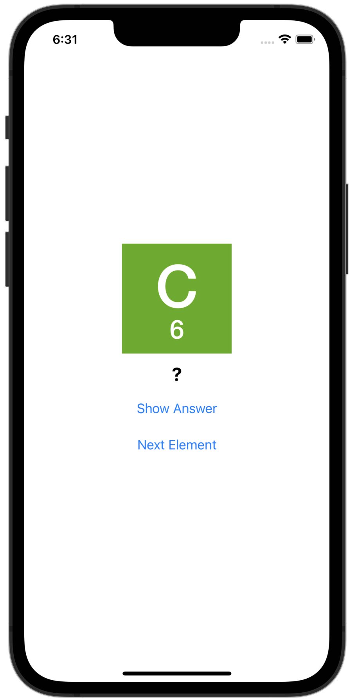

# Chemical-Element-Quiz

This is an app to quiz users on the elements of the periodic table.

The user sees the element symbol and atomic weight, then taps a button to reveal the name of the element.

Based on Develop in Swift by Apple.

